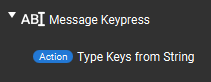
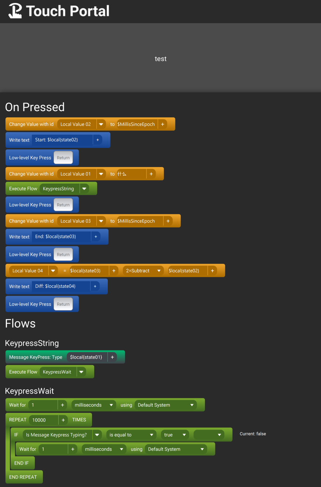

# TouchPortal Message Key Press Plugin

- [TouchPortal Message Key Press Plugin](#touchportal-message-key-press-plugin)
- [Description](#description)
- [Change Log](#change-log)
- [System Requirements](#system-requirements)
- [Action](#action)
- [Example](#example)
- [Build Notes](#build-notes)
  - [Your own build](#your-own-build)
- [Dependencies](#dependencies)
- [Versioning](#versioning)
- [Authors](#authors)
- [License](#license)
- [Bugs/Enhancements](#bugsenhancements)
- [Acknowledgements](#acknowledgements)

# Description
Touch Portal's default "Write Text" action uses copy/paste functionality.  This plugin adds the capability of actual keypresses of a set of text instead of the copy/paste method.  Should be able to support multi-lingual characters as long as they are part of the unicode set. 

# Change Log
```
v2.0.0 - Update to use Rust Binary
    Updates: Instead of using a jar which required external Java, this uses a Rust binary to execute the typing which seems to work better
    States: message_keypress_typing - True or False - will tell when the plugin is typing or not.
v1.0.0 - Initial Release
    Actions:
      - Type Keys from String - type out a string like if it was typed on a keyboard
    States: None
    Events: None
```

# System Requirements

- Touch Portal

# Action
Only 1 action is provided from this plugin currently



- Type Keys from String
  - Desc: Takes in a string (max 4000 characters will work) and will then start typing those characters like using a keyboard. 

# Example

To utilize the new `message_keypress_typing` state the "most efficient" way is something like the following button

The flow that is executed, types the message, and then calls another flow that does a wait, then repeat loop that checks the status of the `message_keypress_typing` state, when the state is true, it will sleep for 1 millisecond and loop again, else it just allows the loop to complete (near instantaneous) and then allows the rest of the flow execution afterwards to complete.  If you have questions about this, hit me up in the #message_keypress discord channel on the Touch Portal Official Discord.




# Build Notes

Currently the rust binary is prebuilt in the src directory - working on getting that to be part of the "compile" phase so it's dynamic by OS type.

## Your own build

If you want to build this yourself, you will need to fork then clone the repo
run `npm install` to pull in the dependencies

Run one of the following depending on your OS of choice. It will package the code into a binary, and drop a .tpp file into the Installers directory

Windows: run `npm run build-win`

Mac(Intel): coming soon 

Mac(Arm64): coming soon

Linux: coming soon

# Dependencies
 - [pkg](https://www.npmjs.com/package/pkg)
 - [touchportal-api](https://www.npmjs.com/package/touchportal-api)

# Versioning

We use [SemVer](http://semver.org/) for versioning. For the versions available, see the [tags on this repository](https://github.com/spdermn02/touchportal_messagekeypress/tags).

# Authors

- **Jameson Allen** - _Initial work_ - [Spdermn02](https://github.com/spdermn02)

# License

This project is licensed under the MIT license - see the [LICENSE](LICENSE) file for details

# Bugs/Enhancements
Use the Github Issues tab to report any bugs/enhancements for this plug-in. Or mention them in the Official Touch Portal discord channel #message-keypress

# Acknowledgements
1. Thank you to Reinier and Ty the Touch Portal Creators
2. Thank you to `Gitago` for testing initially
3. Thank you to `Magicker` for additional testing
4. Thank you to `Der Apfelmann, Baby` for additional testing of the Rust based version